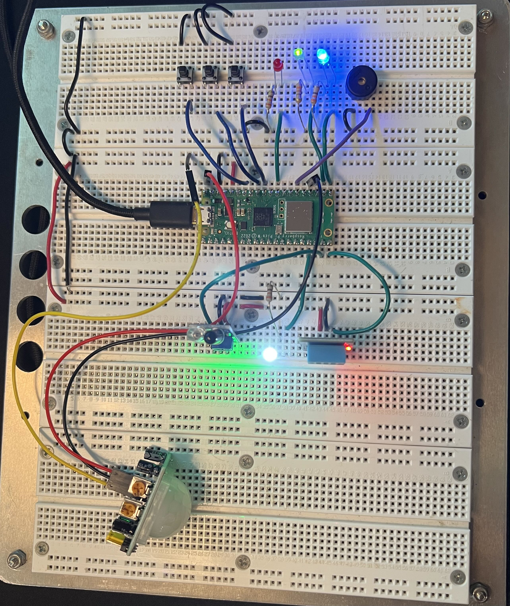
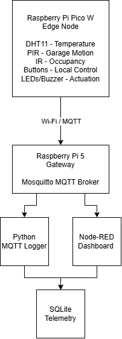
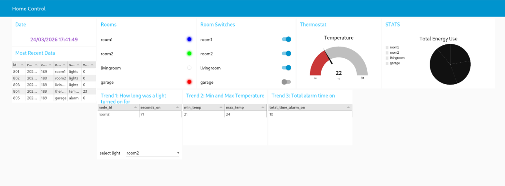
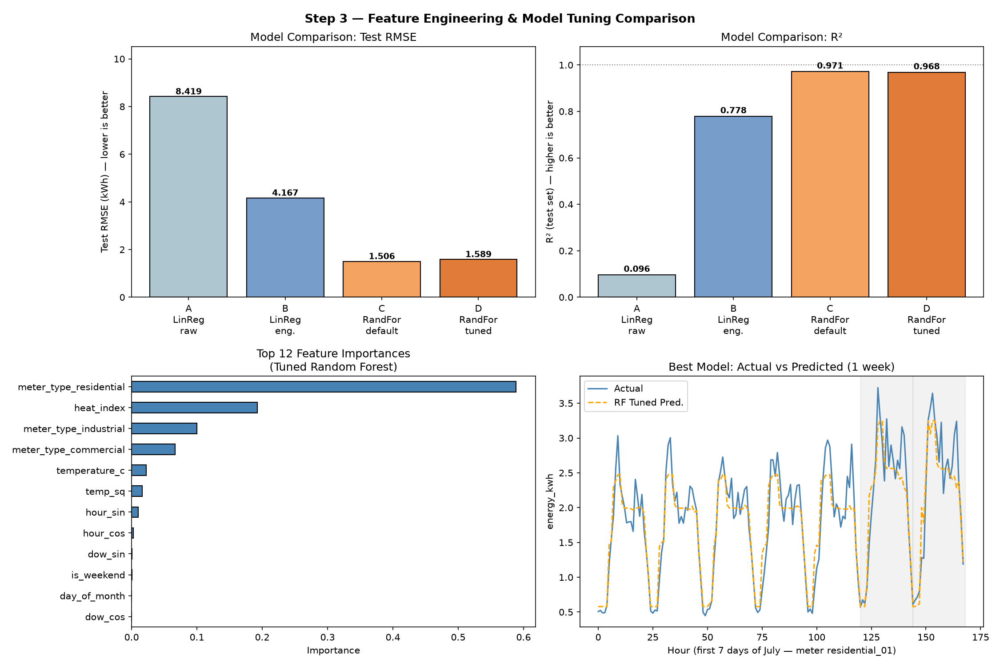
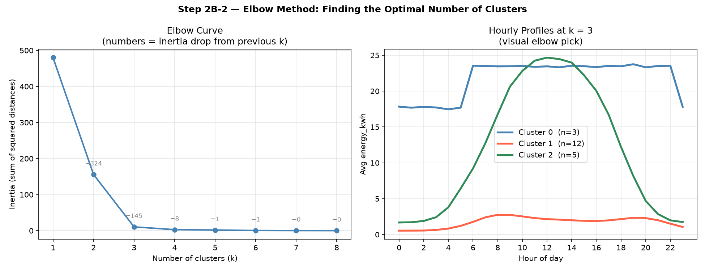

# Smart Home IoT Platform

A full-stack IoT home automation prototype built around a Raspberry Pi Pico W edge node and Raspberry Pi gateway. The system combines local sensing and automation, MQTT communication, SQLite telemetry storage, a Node-RED web dashboard, and a separate machine-learning analytics extension.

Developed as a two-person ECE 270 project at the University of Victoria with Matthew Pearson.



## Overview

This project explores the complete path from physical sensors and actuators to a remotely accessible IoT application.

The Raspberry Pi Pico W acts as the edge node, monitoring environmental and motion sensors while controlling room lighting and a garage alarm. Telemetry and control messages are exchanged over MQTT with a Raspberry Pi gateway, where data is persisted in SQLite and displayed through a Node-RED dashboard.

The project was developed incrementally from a locally controlled embedded system into a networked full-stack IoT platform.

### System Architecture



## Features

- Interrupt-driven physical lighting controls with software debouncing
- IR-based occupancy lighting with automatic timeout
- PIR-based garage security alarm with visual and audible alerts
- DHT11 environmental sensing
- Non-blocking timing for concurrent embedded tasks
- Bidirectional MQTT communication over Wi-Fi
- Structured JSON telemetry
- Remote lighting and alarm control
- SQLite telemetry persistence
- Node-RED web dashboard for monitoring and control
- Historical data queries and energy-use visualization
- Node-RED authentication hardening using BCrypt
- Smart-grid energy prediction and usage-pattern clustering

## Hardware

The edge node is built around a **Raspberry Pi Pico W** and includes:

- DHT11 temperature/humidity sensor
- PIR motion sensor
- IR obstacle/occupancy sensor
- Physical push buttons
- Room and status LEDs
- PWM-driven buzzer

Local automation continues to operate on the Pico W while network connectivity provides telemetry and remote control.

## MQTT Communication

The Pico W communicates with the gateway through a Mosquitto MQTT broker using two primary topics:

```text
smart-home/status
smart-home/control
```

Telemetry is published as structured JSON:

```json
{
    "count": 42,
    "node": "room1",
    "sensor": "lights",
    "status": "on"
}
```

The dashboard can send commands such as:

```text
room1:on
room1:off

room2:on
room2:off

livingroom:on
livingroom:off

garage:on
garage:off
```

This provides bidirectional communication between the physical edge node and the web application.

## Node-RED Dashboard

Node-RED provides the application layer for the system, allowing sensor information to be monitored and actuators to be controlled remotely.



The dashboard includes room controls, system status information, environmental monitoring, historical SQLite queries, and energy-use visualization.

## Data Pipeline

A Python MQTT subscriber receives telemetry from the Pico W and persists each event to SQLite.

Each record contains:

```text
timestamp
message counter
node ID
sensor type
value
```

Using a structured database instead of only text logs makes it possible to perform historical queries and feed stored information back into the Node-RED dashboard.

## Challenges and Solutions

### Maintaining responsive local control

Early versions of the system used several independent sensor and actuator routines. Combining them into one application introduced the risk that blocking delays in one subsystem could prevent other components from responding.

The integrated firmware uses timestamp-based scheduling and non-blocking timers for operations such as the living-room light timeout, environmental sampling, alarm blinking, and periodic telemetry. Physical buttons also use software debouncing to prevent a single press from producing multiple events.

### Integrating the physical and web interfaces

The system needed to support both physical controls and commands originating from the web dashboard without one interface interfering with the other.

A bidirectional MQTT architecture was used so that the Pico could publish its current state while independently receiving control commands. This separated the embedded control logic from the user interface and made additional applications easier to integrate.

### Creating a queryable telemetry pipeline

Raw MQTT messages are useful for real-time communication but not for historical analysis.

A Python gateway service was therefore added to parse JSON telemetry and persist timestamped records to SQLite. Node-RED can query this database to display recent readings and historical system statistics.

## Smart-Grid Machine Learning Extension

A separate analytics extension explores how machine-learning techniques can be applied to smart-grid energy data.

The synthetic dataset contains **14,880 hourly observations from 20 smart meters** representing residential, commercial, and industrial consumers.

### Energy Consumption Prediction

Several regression approaches were compared:

| Model | Test RMSE | Test R² |
|---|---:|---:|
| Linear Regression — raw features | 8.419 kWh | 0.096 |
| Linear Regression — engineered features | 4.167 kWh | 0.779 |
| **Random Forest — default** | **1.506 kWh** | **0.971** |
| Random Forest — tuned | 1.589 kWh | 0.968 |

Feature engineering included cyclical time representations, temperature-derived features, weekend information, and meter category.

The best-performing model was the default Random Forest, reducing test RMSE by approximately **82%** compared with the raw-feature Linear Regression baseline.



### Unsupervised Usage-Pattern Discovery

K-Means clustering was also applied without providing the meter category as an input feature.

Each meter was represented by its average 24-hour energy-use profile. The elbow method showed a strong bend at **k = 3**.

The resulting clusters separated the synthetic dataset into:

```text
Cluster 0 → 3 industrial meters
Cluster 1 → 12 residential meters
Cluster 2 → 5 commercial meters
```

In this synthetic dataset, the three discovered clusters corresponded exactly to the three underlying consumer categories.



> The machine-learning dataset is synthetically generated for experimentation. These results demonstrate the analysis workflow and should not be interpreted as performance on real-world utility data.

## Technologies

**Embedded**
- Raspberry Pi Pico W
- MicroPython
- GPIO interrupts
- PWM
- DHT11, PIR and IR sensing

**IoT / Backend**
- MQTT
- Mosquitto
- Raspberry Pi 5
- Python
- SQLite
- JSON

**Application**
- Node-RED
- Web-based dashboard
- SQL queries

**Data Science**
- pandas
- NumPy
- scikit-learn
- Matplotlib
- Linear Regression
- Random Forest
- K-Means clustering

## Repository Structure

```text
iot-smart-home/
├── edge-node/
│   ├── main.py
│   ├── config.example.py
│   └── simple.py
│
├── mqtt-logger/
│   └── logger.py
│
├── node-red/
│   └── flows.json
│
├── machine-learning/
│   ├── generate_data.py
│   ├── requirements.txt
│   ├── regression/
│   │   ├── baseline_model.py
│   │   ├── learning_curves.py
│   │   └── feature_engineering.py
│   └── clustering/
│       ├── kmeans_clustering.py
│       └── elbow_method.py
│
└── images/
    ├── hardware.jpg
    ├── dashboard.png
    ├── ml-model-comparison.png
    └── ml-clustering.png
```

## Running the Project

### Edge Node

Copy the example configuration:

```bash
cp edge-node/config.example.py edge-node/config.py
```

Update the Wi-Fi and MQTT broker settings in `config.py`, then upload the contents of `edge-node/` to a Raspberry Pi Pico W running MicroPython.

### MQTT Logger

Install the MQTT dependency:

```bash
pip install paho-mqtt
```

Start the logger:

```bash
python mqtt-logger/logger.py
```

The logger listens for telemetry on:

```text
smart-home/status
```

and creates a local SQLite database automatically.

### Machine Learning

Create a virtual environment and install the dependencies:

```bash
python -m venv .venv
pip install -r machine-learning/requirements.txt
```

Generate the synthetic dataset:

```bash
python machine-learning/generate_data.py
```

Then run any of the analysis scripts, for example:

```bash
python machine-learning/regression/feature_engineering.py
python machine-learning/clustering/elbow_method.py
```

## What I Learned

This project gave me experience designing across multiple layers of an IoT system rather than treating embedded firmware, networking, databases, and user interfaces as isolated components.

Key takeaways included:

- structuring embedded firmware around non-blocking event handling
- designing MQTT topics and JSON messages for bidirectional communication
- connecting embedded devices to backend data pipelines
- storing and querying IoT telemetry with SQLite
- building interactive monitoring and control interfaces with Node-RED
- securing web-accessible IoT interfaces
- evaluating machine-learning models using RMSE and R²
- using feature engineering and unsupervised learning to uncover structure in data

## Project Context

Developed as part of **ECE 270** at the **University of Victoria**.

This repository is a cleaned portfolio version of the project and excludes course instructions, submitted reports, credentials, and other assignment materials.